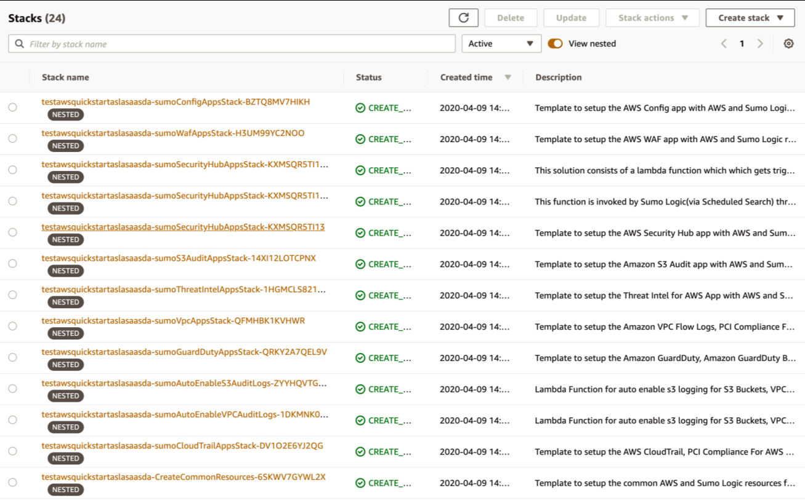
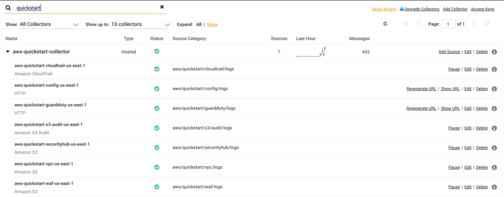
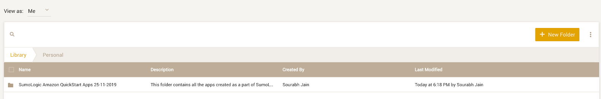
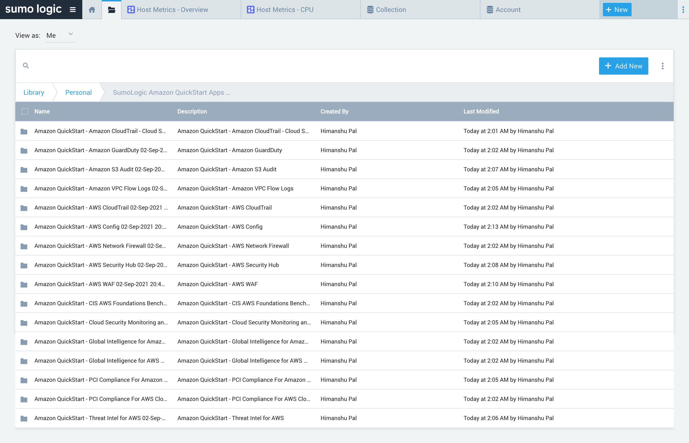
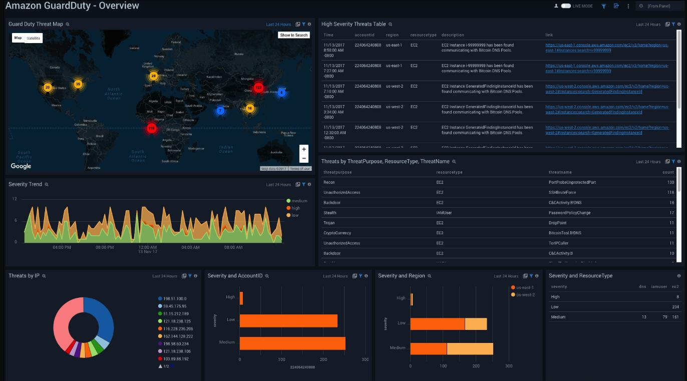

// Add steps as necessary for accessing the software, post-configuration, and testing. Don’t include full usage instructions for your software, but add links to your product documentation for that information.
//Should any sections not be applicable, remove them

== Test the deployment
=== AWS account
After the deployment completes, you see the main stack, `QuickStartApps`, in addition to multiple nested stacks.

:xrefstyle: short
[#output1]
.Example output of created resources
[link=images/output1.png]

=== {partner-product-short-name} account
Confirm that the AWS CloudFormation template installed the collectors and sources for your Sumo Logic apps.

:xrefstyle: short
[#output2]
.Example output of collectors and sources
[link=images/output1.png]

== Post-deployment steps
=== If using an existing S3 bucket
If you use an existing S3 bucket with logs, create an SNS topic (`SumoSNSTopic-{StackName}`) that subscribes to the Sumo Logic sources. After the deployment completes, add that SNS topic to the S3 bucket events. For more information, see https://docs.aws.amazon.com/AmazonS3/latest/user-guide/enable-event-notifications.html[How do I enable and configure event notifications for an S3 bucket?^]

=== If using AWS WAF logs for an Amazon Kinesis Data Firehose delivery stream
If you install AWS WAF, AWS CloudFormation creates a delivery stream (`QuickStartDeliveryStream{Region}`) in your Kinesis configuration. You must configure Web ACL in AWS WAF to send logs to the delivery stream. For more information, see https://docs.aws.amazon.com/waf/latest/developerguide/logging.html[Logging Web ACL traffic information^].

=== View the Sumo Logic dashboards
After the deployment completes, the Sumo Logic apps are added to your Sumo Logic personal-account library in a folder named `SumoLogic Amazon QuickStart Apps <date>`.

[#qsappfolder]
.Top-level Quick Start apps folder
[link=images/qsappfolder.png]

Under the `SumoLogic Amazon QuickStart Apps <date>` folder, there are subfolders that represent each app along with the date and timestamp.

[#servicefolder]
.Individual service folders
[link=images/servicefolder.png]

To open the services dashboard, choose its folder in the Sumo Logic console. For instance, under the **Amazon GuardDuty** folder, open the **Amazon GuardDuty – Overview** dashboard to see detected threats.

[#dashboard]
.Amazon GuardDuty dashboard
[link=images/dashboard.jpg]

== Best practices for using {partner-product-name}
// Provide post-deployment best practices for using the technology on AWS, including considerations such as migrating data, backups, ensuring high performance, high availability, etc. Link to software documentation for detailed information.
If you want to use this Quick Start across multiple AWS accounts and Regions, rename the top-level parent folder of your Sumo Logic account (under your personal folder) to reflect the correct account and Region.

For each S3 bucket, follow the best practices documented under https://aws.amazon.com/premiumsupport/knowledge-center/secure-s3-resources/[How can I secure the files in my Amazon S3 bucket?^] to secure all of your S3 objects. {partner-product-name} can monitor the following security and compliance aspects of your AWS environment:

* Threat monitoring and other security findings
* Configuration and S3 Audit
* PCI DSS compliance
* CIS AWS compliance

// === Security
// // Provide post-deployment best practices for using the technology on AWS, including considerations such as migrating data, backups, ensuring high performance, high availability, etc. Link to software documentation for detailed information.

// _Add any security-related information._

== Additional resources
//Provide any other information of interest to users, especially focusing on areas where AWS or cloud usage differs from on-premises usage.

=== AWS resources
* https://aws.amazon.com/getting-started/[Getting Started with AWS^]
* https://docs.aws.amazon.com/general/latest/gr/[AWS General Reference^]
* https://docs.aws.amazon.com/general/latest/gr/glos-chap.html[AWS Glossary^]

=== AWS services used by the deployment
* https://docs.aws.amazon.com/cloudformation/[AWS CloudFormation^]
* https://aws.amazon.com/cloudwatch/[Amazon CloudWatch^]
* https://docs.aws.amazon.com/iam/[AWS IAM^]
* https://aws.amazon.com/sns/[Amazon SNS^]
* https://aws.amazon.com/lambda/[AWS Lambda^]
* https://aws.amazon.com/kinesis/data-firehose/[Amazon Kinesis Data Firehose^]
* https://aws.amazon.com/s3/[Amazon S3^]

=== Sumo Logic documentation
* https://help.sumologic.com/07Sumo-Logic-Apps/01Amazon_and_AWS[Sumo Logic and AWS apps^]
* https://help.sumologic.com/07Sumo-Logic-Apps/01Amazon_and_AWS[Sumo Logic Doc Hub^]
* https://www.sumologic.com/solutions/security-intelligence/[Sumo Logic Cloud SIEM^]

=== Other Quick Start reference deployments
* https://aws.amazon.com/quickstart/[AWS Quick Start home page^]
