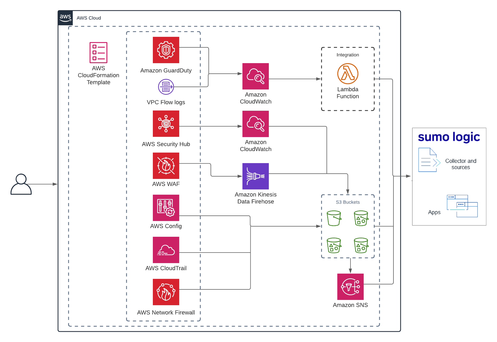

:xrefstyle: short

Deploying this Quick Start with *default parameters* builds the following environment in 
a specific account and Region in the AWS Cloud. 

// Replace this example diagram with your own. Follow our wiki guidelines: https://w.amazon.com/bin/view/AWS_Quick_Starts/Process_for_PSAs/#HPrepareyourarchitecturediagram. Upload your source PowerPoint file to the GitHub {deployment name}/docs/images/ directory in this repo. 

:xrefstyle: short
[#architecture1]
.Quick Start architecture for {partner-product-short-name} on AWS
// [link=images/architecture.png]

As shown in <<architecture1>>, the Quick Start sets up the following:

* Amazon GuardDuty to detect malicious activity and behavior to protect AWS accounts and workloads. 

* Amazon VPC Flow Logs to capture information about IP traffic going to and from network interfaces in your VPC. 

* AWS Security Hub to assess security alerts and security posture across AWS 

* AWS WAF to protect your web applications from common web exploits. 

* AWS Config to record and evaluate configurations of your AWS resources. 

* AWS CloudTrail to track user activity and API usage.

* AWS Network Firewall to deploy essential network protections for all of your Amazon Virtual Private Clouds (VPCs) 

* Multiple CloudFormation stacks are deployed in your environment to set up forwarding of data to Sumo Logic. Each stack consists of more than one AWS resource, including Amazon S3 buckets, AWS Lambda functions, and Amazon Kinesis Data Firehose delivery streams. 

* AWS Lambda functions to create a collector and multiple sources, and to install apps on your Sumo Logic account. 

* Amazon S3 buckets capture logs from the various AWS services. 

* The Sumo Logic collector and sources to receive logs from the S3 buckets. 

* Amazon Kinesis Data Firehose delivery streams to transfer logs from AWS WAF to S3 buckets. 

* S3 Event Notification triggers an Amazon Simple Notification Service (Amazon SNS) topic when there is a new object in a bucket.
